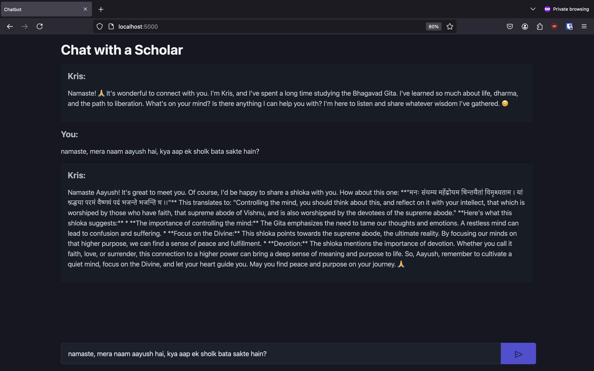

# Kris: Geeta Scholar Chatbot

Kris is a chatbot that uses Gemini 1.5 flash as its model.
He's a friendly bot designed to help you with your life problems with wisdom from Geeta.

---

Tools Used:

- Python
- Gemini API (https://aistudio.google.com/)
- HTMX (https://htmx.org)
- Flask (https://flask.palletsprojects.com/)
- PicoCSS (https://picocss.com)
- HTML

---
